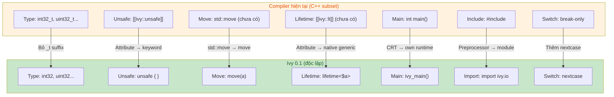

# Kế hoạch phát triển Ivy 0.1 — Ngôn ngữ độc lập

- **Trạng thái**: Active — chuyển đổi từ C++ subset sang ngôn ngữ độc lập
- **Cập nhật**: 2026-09-10
- **Người tạo**: User + AI

---

## Mục tiêu

Ivy 0.1 là phiên bản đầu tiên của Ivy với tư cách là một **ngôn ngữ lập trình
độc lập**, không còn là "safe C++ subset". Tài liệu này kế hoạch hóa việc
chuyển đổi từ trình biên dịch hiện tại (đã hoàn thành Giai đoạn 1–9 của
[OLD_PLAN.md](file:///d:/project/Ivy/ivyc/OLD_PLAN.md)) sang ngôn ngữ Ivy độc
lập được mô tả trong [docs/](file:///d:/project/Ivy/ivyc/docs/) và
[spec/](file:///d:/project/Ivy/ivyc/spec/).

### Tóm tắt thay đổi cốt lõi

| Khía cạnh | Hiện tại (C++ subset) | Ivy 0.1 (độc lập) |
|-----------|----------------------|-------------------|
| **Tên type** | `int32_t`, `uint32_t`, `float32_t`... | `int32`, `uint32`, `float32`... (bỏ suffix `_t`) |
| **C-style types** | `#pragma ivy cnumber` gate | Loại bỏ hoàn toàn (chỉ giữ cho FFI `import cpp`) |
| **Unsafe** | `[[ivy::unsafe]] { }` | `unsafe { }` (keyword, không phải attribute) |
| **Move** | `std::move(a)` (chưa triển khai) | `move(a)` (builtin, không cần `std::`) |
| **Lifetime** | `[[ivy::lt(a)]]` (chưa triển khai) | `lifetime<$a>` + `const T& $a x` (syntax native) |
| **Entry point** | `main()` + CRT `_start` | `ivy_main()` + CRT `_start` (không tự viết `_start`) |
| **Import** | `#include <ivy.h>` | `import ivy.io` (module system) |
| **Function syntax** | `int32_t add(...)` | `int32 add(...)` hoặc `fn add(...) -> int32` |
| **Trailing return** | Không có | `fn name(params) -> Type { }` |
| **Switch fallthrough** | `break` enforcement | `nextcase` / `nextcase label;` (C3-inspired) |
| **Null** | `nullptr` (chỉ unsafe) | `nullptr` (chỉ unsafe); safe dùng `ivy::optional<T>` |
| **Error handling** | Không có | `ivy::expected<T, E>` (không try/catch) |

---

## Hiện trạng tổng quan (2026-09-10)

### Trình biên dịch đã hoàn thành (Giai đoạn 1–9)

Xem chi tiết trong [OLD_PLAN.md](file:///d:/project/Ivy/ivyc/OLD_PLAN.md). Tóm tắt:

| Thành phần | Trạng thái | Ghi chú |
|-----------|-----------|---------|
| Lexer | ✅ | Token stream đầy đủ; raw string, char escape, string prefix |
| Preprocessor | ✅ | `#include`, `#define`, conditional, `#pragma`, `#`/`##` |
| Parser | ✅ | AST đầy đủ; template, concept, module, inheritance |
| HIR | ✅ | Type check, name resolution, constexpr folding, template instantiation |
| MIR | ✅ | CFG lowering, lifetime annotation |
| Interpreter | ✅ | IvyInterpret v0.2 (MIR-based, `--run`) |
| Codegen | ✅ | LLVM IR emitter; Itanium/MSVC ABI mangling |
| Linking | ✅ | Object file emission + linker invocation |
| Modules | ✅ | `.ivm` binary interface, `export module` / `import` |

### Khoảng cách giữa compiler hiện tại và spec Ivy 0.1

Tài liệu trong `docs/` mô tả ngôn ngữ Ivy độc lập. Trình biên dịch hiện tại chưa
triển khai một số cú pháp mới. Dưới đây là bản đồ khoảng cách:



---

## Lộ trình Ivy 0.1

### Giai đoạn A — Cú pháp ngôn ngữ độc lập (core syntax migration)

Đây là bước đầu tiên: thay đổi cú pháp lexer/parser để nhận diện ngôn ngữ Ivy
mới. Mỗi task có thể làm độc lập, không phá vỡ backward-compat cho đến khi
migration hoàn tất.

| # | Task | Độ khó | Chi tiết triển khai |
|---|------|--------|---------------------|
| A1 ✅| **Đổi tên type bỏ `_t` suffix** | ★★ | Lexer: thêm `int8`/`int16`/`int32`/`int64`/`uint8`/`uint16`/`uint32`/`uint64`/`float16`/`float32`/`float64`/`float128`/`bfloat16`/`int128`/`uint128`/`iptr`/`uptr`/`size` làm keyword. HIR/Codegen: map type mới → LLVM type (giống `_t` cũ). Giữ `_t` variant làm alias (backward-compat trong giai đoạn chuyển đổi). Theo [Basic_Types.md](file:///d:/project/Ivy/ivyc/docs/Languag_%20Fundamentals/Basic_Types.md) |
| A2 ✅| **`unsafe` keyword block** | ★ | Lexer: thêm `unsafe` làm keyword. Parser: `unsafe { }` → parse như compound statement, set flag `inUnsafeBlock`. Thay thế `[[ivy::unsafe]] { }` (giữ attribute form làm alias tạm thời). HIR: `requireUnsafe()` check cả hai dạng. Theo [Unsafe_and_Casts.md](file:///d:/project/Ivy/ivyc/docs/Ownership/Unsafe_and_Casts.md) |
| A3 ✅| **`fn` keyword + trailing return type** | ★★ | Parser: `fn name(params) -> Type { body }` — new function declaration form. Dùng chung `parseFunction` với flag `isTrailingReturn`. `auto` cho return type vẫn dùng được (deduction). Theo [Functions.md](file:///d:/project/Ivy/ivyc/docs/Languag_%20Fundamentals/Functions.md) |
| A4 ✅| **`move()` builtin** | ★★ | Parser: nhận diện `move(expr)` như builtin function call (không cần `#include`). HIR: `move(a)` → mark `a` as moved-out, kiểm tra use-after-move ở compile-time. MIR: track move state. Theo [Ownership_Model.md](file:///d:/project/Ivy/ivyc/docs/Ownership/Ownership_Model.md) |
| A5 ✅| **`lifetime<$a>` syntax** | ★★★ | Lexer: nhận diện `$identifier` làm lifetime variable token. Parser: `lifetime<$a, $b>` declaration + `const T& $a x` annotation. HIR: lifetime constraint check (return lifetime phải thỏa). MIR: borrow checker (aliasing XOR mutability). Theo [Borrowing_and_Lifetimes.md](file:///d:/project/Ivy/ivyc/docs/Ownership/Borrowing_and_Lifetimes.md) |
| A6 ✅| **`nextcase` statement** | ★★ | Parser: `nextcase;` (unlabeled) + `nextcase LABEL;` (labeled) + `switch LABEL: { }` (labeled switch). MIR: jump to next/target case entry point. RAII: dtor cleanup case-local vars trước khi jump. Theo [Statements.md](file:///d:/project/Ivy/ivyc/docs/Languag_%20Fundamentals/Statements.md) |
| A7 ✅| **`import cpp` directive** | ★★ | Mở rộng module system (9.2): `import cpp <header>` hoặc `import cpp "file"`. Discovery: tìm Clang/GCC/MSVC trên host. Compile C++ header → object, link. Safety tier classification (safe/unsafe/unknown). Theo [Cpp_Interoperability.md](file:///d:/project/Ivy/ivyc/docs/Interoperability/Cpp_Interoperability.md) |

### Giai đoạn B — Ownership & Safety system

Triển khai hệ thống an toàn memory đầy đủ — trái tim của Ivy.

| # | Task | Độ khó | Chi tiết triển khai |
|---|------|--------|---------------------|
| B1 ✅ | **Borrow Checker (aliasing XOR mutability)** | ★★★★ | MIR: track mọi borrow (mutable/immutable) per variable. Rule: nhiều `const T&` OK, chỉ 1 `T&`, không trộn. Error: "cannot borrow mutably while immutably borrowed". Phân tích CFG để xác định borrow scope end. Theo [ownership.md](file:///d:/project/Ivy/ivyc/spec/ownership.md) §3 |
| B2 ✅ | **Lifetime verification** | ★★★★ | Dựa trên A5. MIR: mỗi reference có lifetime tag. Check: reference không outlive data. Function return ref → lifetime phải thỏa. Dangling reference detection. Theo [ownership.md](file:///d:/project/Ivy/ivyc/spec/ownership.md) §3.4 |
| B3 | **Move semantics + use-after-move check** | ★★★ | Dựa trên A4. MIR: variable state tracking (initialized / moved-out). Read moved-out → compile error. Reassign → re-initialize. `move()` trên rvalue → OK. Theo [ownership.md](file:///d:/project/Ivy/ivyc/spec/ownership.md) §2.4 |
| B4 | **Null safety enforcement** | ★★ | Safe zone: `nullptr` forbidden, raw pointer forbidden. Dùng `ivy::optional<T>` thay thế. Unsafe: `nullptr` + `nullptr_t` OK. Parser/HIR: cấm `nullptr` literal ngoài `unsafe { }`. Theo [ownership.md](file:///d:/project/Ivy/ivyc/spec/ownership.md) §4 |
| B5 | **`ivy::expected<T, E>`** | ★★★ | Stdlib type: `struct expected { T value; E error; bool hasValue; }`. Hỗ trợ return value-or-error. Pattern: `if (result.hasValue) { } else { }`. Thay thế try/catch hoàn toàn. Theo [Null_and_Error_Handling.md](file:///d:/project/Ivy/ivyc/docs/Ownership/Null_and_Error_Handling.md) |
| B6 | **`ivy::optional<T>`** | ★★ | Stdlib type: `struct optional { T value; bool hasValue; }`. `ivy::nullopt` constant. Hỗ trợ `hasValue` check. Thay thế nullable pointer trong safe zone |

### Giai đoạn C — Runtime & linkage (học theo Rust)

Ivy 0.1 **không tự viết lại C Runtime**. Cách tiếp cận giống Rust: dùng CRT có
sẵn của nền tảng, tĩnh hóa khi cần, chỉ tự viết **lớp wrapper** an toàn bên trên.

> **Bài học từ Rust**: Ngay cả Rust — ngôn ngữ an toàn memory nhất — vẫn link
> CRT mặc định (glibc/Linux, ucrt/Windows, libSystem/macOS). Rust chỉ tự triển
> khai khi ở chế độ `#![no_std]` (bare-metal/embedded). Ivy 0.1 là ngôn ngữ
> ứng dụng, không phải OS/firmware → **dùng CRT, không tự viết lại**.

| # | Task | Độ khó | Chi tiết triển khai |
|---|------|--------|---------------------|
| C1 | **`ivy_main()` entry point** | ★★ | Codegen: emit `main()` (C entry, CRT gọi) → gọi `ivy_main()`. **Không** tự emit `_start` (giao cho CRT). `ivy_main()` thay `main()` trong user code. Return `int32` exit code. Đơn giản hơn C1 cũ vì không cần viết `_start` asm |
| C2 | **Memory allocator dùng libc** | ★★ | `libivyrt` dùng `malloc`/`free` của libc bên trong, nhưng ** expose Ivy-safe API** (`__ivy_alloc`/`__ivy_free`). Arena layer (bump alloc) phía trên cho temporary. Không reimplement `malloc` — chỉ wrap. Tương tự `std::alloc::System` của Rust |
| C3 | **`ivy::print()`/`format()` type-safe** | ★★ | `ivy::print()` / `ivy::println()` — type-aware wrapper. Dùng `write` syscall (POSIX) hoặc `WriteFile` (Windows) bên dưới, **không** dùng `printf` trực tiếp. Format string `{}` placeholder. Interpreter: built-in. Tự viết format logic (an toàn), chỉ ủy thác I/O raw cho OS/CRT |
| C4 | **Static CRT linking (tùy chọn)** | ★★ | CLI flag `--crt-static`: link CRT tĩnh (như Rust `crt-static`). Linux: link `libc.a` thay vì `libc.so`. Windows: link `libcmt` thay vì `msvcrt`. Mặc định: dynamic link (như Rust). Target bare-metal sau này: `#![no_std]` tương đương |
| C5 | **Ivy runtime library (`libivyrt`)** | ★★ | `libivyrt` — precompiled static lib: allocator (wrap libc), print/format, panic, string ops cơ bản. Link mặc định. Viết bằng C (bootstrap) hoặc Ivy (sau self-host). **Dùng libc bên trong, nhưng user code không gọi libc trực tiếp** |

### Giai đoạn D — Standard library

Stdlib viết bằng Ivy, đủ để viết app thực dụng.

| # | Task | Độ khó | Chi tiết triển khai |
|---|------|--------|---------------------|
| D1 | **`ivy::string`** | ★★★ | Owned string, UTF-8. Methods: `len()`, `empty()`, `append()`, `concat()`, `substr()`, `==`/`!=`. RAII (auto free). Move semantics. Theo OLD_PLAN.md §10.4 |
| D2 | **`ivy::vector<T>`** | ★★★ | Dynamic array. Methods: `push()`, `pop()`, `len()`, `[]` (bounds-checked), `iter()`. RAII. Move semantics. Bounds check inline → `__ivy_panic` nếu out-of-range (skip trong unsafe) |
| D3 | **`ivy::slice<T>`** | ★★ | View vào array/vector, không own. Bounds-checked. Thay raw pointer + length. `T[N]` array → `slice<T>` khi pass to function |
| D4 | **`ivy::unique_ptr<T>`** | ★★★ | RAII smart pointer. Move-only (không copy). `*` deref (chỉ unsafe hoặc qua safe accessor). Auto free tại scope-exit. Dựa trên B3 move semantics |
| D5 | **`ivy::hash_map<K,V>` / `ivy::hash_set<T>`** | ★★★ | Hash table. `[]` access, `insert()`, `contains()`, `remove()`. Iterator support. Linear probing hoặc robin hood |
| D6 | **`ivy::io` module** | ★★ | `io::print()`, `io::println()`, `io::eprint()`, `io::read_line()`. Stdout/stderr/stdin. File I/O: `io::File`, `io::read_file()`, `io::write_file()` |
| D7 | **`ivy::math` module** | ★ | Math functions: `abs()`, `min()`, `max()`, `sqrt()`, `sin()`, `cos()`, `pow()`, `floor()`, `ceil()`. Constexpr-friendly |

### Giai đoạn E — Loại bỏ C++ legacy

Sau khi stdlib đủ, loại bỏ các C++ legacy features.

| # | Task | Độ khó | Chi tiết triển khai |
|---|------|--------|---------------------|
| E1 | **Loại bỏ `#pragma ivy cnumber`** | ★★ | Xóa C-style types (`int`, `long`, `short`, `unsigned`, `float`, `double`, `char` ngoài `unsafe`). Chỉ giữ cho FFI `import cpp`. Migration script: đổi type cũ sang Ivy type. Theo OLD_PLAN.md §10.1 |
| E2 | **Loại bỏ `[[ivy::unsafe]]` attribute** | ★ | Sau A2 ổn định: xóa attribute form, chỉ giữ `unsafe { }` keyword. Error nếu gặp `[[ivy::unsafe]]` |
| E3 | **Loại bỏ `_t` suffix type** | ★ | Sau A1 migration: xóa `int32_t`/`uint32_t`/etc. Chỉ giữ `int32`/`uint32`/etc. Error nếu gặp `_t` variant |
| E4 | **Preprocessor → module-only** | ★★★ | Ivy code: chỉ dùng `import`, không `#include`. Preprocessor chỉ cho FFI/macro trong `unsafe`. `#include` cấm trong `.ivy` file (chỉ `.cpp` legacy). Theo OLD_PLAN.md §10.3 |
| E5 | **Loại bỏ `.cpp` extension support** | ★ | CLI: chỉ nhận `.ivy`. `.cpp`/`.cc`/`.cxx`/`.c` → error "use .ivy extension". Migration: `ivyc migrate file.cpp` → auto-convert |

### Giai đoạn F — Self-hosting & công cụ

Mốc cuối: Ivy tự biên dịch chính nó.

| # | Task | Độ khó | Chi tiết triển khai |
|---|------|--------|---------------------|
| F1 | **Port ivyc sang Ivy (từng tầng)** | ★★★★★+ | Bắt đầu bằng port lexer → parser → HIR → MIR → codegen. Dùng IvyInterpret để chạy bootstrap. Mỗi tầng port xong, dùng Ivy-compiler để compile tầng tiếp theo. Theo OLD_PLAN.md §10.5 |
| F2 | **`ivyc fmt` — formatter** | ★★ | Auto-format Ivy code. Style guide: indent 4 spaces, `{` cùng dòng, no trailing whitespace. AST-based (không text-based) |
| F3 | **`ivyc doc` — documentation generator** | ★★ | Generate HTML docs từ `///` doc comments. Support `@param`, `@return`, `@example`. Cross-reference |
| F4 | **LSP server** | ★★★ | Language Server Protocol. Features: go-to-definition, hover, autocomplete, diagnostics, rename refactoring. Dùng ivyc sebagai backend |
| F5 | **Ivy 1.0 spec** | ★★ | Formal specification document. Syntax grammar (EBNF), type system rules, ownership/borrow rules, ABI specification. Versioning: `__ivy__ = 202604L` |
| F6 | **Diagnostic style riêng** | ★ | Error messages có hint sửa lỗi (gợi ý fix). Color output (terminal ANSI). Error codes (IVY-E001). Consistent format: `error[IVY-E001]: message` |

---

## Thứ tự ưu tiên

```mermaid
flowchart LR
    subgraph P1["Ưu tiên 1 — Core syntax"]
        A1["A1: Đổi tên type"]
        A2["A2: unsafe keyword"]
        A3["A3: fn keyword"]
    end

    subgraph P2["Ưu tiên 2 — Safety system"]
        B1["B1: Borrow checker"]
        B3["B3: Move semantics"]
        B4["B4: Null safety"]
    end

    subgraph P3["Ưu tiên 3 — Runtime (wrap CRT)"]
        C1["C1: ivy_main() entry"]
        C3["C3: ivy::print/format"]
        C5["C5: libivyrt (wrap libc)"]
    end

    subgraph P4["Ưu tiên 4 — Stdlib"]
        D1["D1: ivy::string"]
        D2["D2: ivy::vector"]
        D6["D6: ivy::io"]
    end

    subgraph P5["Ưu tiên 5 — Legacy removal"]
        E1["E1: Bỏ cnumber"]
        E3["E3: Bỏ _t suffix"]
        E4["E4: Module-only"]
    end

    subgraph P6["Ưu tiên 6 — Self-host"]
        F1["F1: Port ivyc → Ivy"]
        F5["F5: Ivy 1.0 spec"]
    end

    P1 --> P2 --> P3 --> P4 --> P5 --> P6

    style P1 fill:#c8e6c9,color:#1a5e20
    style P2 fill:#bbdefb,color:#0d47a1
    style P3 fill:#fff3e0,color:#e65100
    style P4 fill:#f3e5f5,color:#7b1fa2
    style P5 fill:#ffcdd2,color:#b71c1c
    style P6 fill:#cfd8dc,color:#263238
```



**Nguyên tắc**: Mỗi task phải có test file trong `examples/`. Mỗi task hoàn
thành → update checklist. Backward-compat maintained cho đến khi giai đoạn E
loại bỏ legacy.

---

## Tiêu chí hoàn thành Ivy 0.1

1. **Cú pháp độc lập**: `int32` (không `int32_t`), `unsafe { }` (không
   `[[ivy::unsafe]]`), `move()` (không `std::move`), `fn` keyword, `lifetime<>`.
2. **Safety system**: Borrow checker (aliasing XOR mutability), lifetime
   verification, use-after-move detection, null safety enforcement.
3. **Runtime (học theo Rust)**: Dùng CRT có sẵn, không tự viết lại. `ivy_main()`
   entry point. `libivyrt` wrap libc (allocator, print/format, panic). Static
   link tùy chọn (`--crt-static`). User code không gọi libc trực tiếp.
4. **Stdlib tối thiểu**: `ivy::string`, `ivy::vector<T>`, `ivy::optional<T>`,
   `ivy::expected<T,E>`, `ivy::io`, `ivy::math` — đủ viết app thực dụng.
5. **Module-only**: Ivy code dùng `import`, không `#include`. Preprocessor chỉ
   cho FFI/macro trong unsafe.

Self-hosting (F1) và Ivy 1.0 spec (F5) thuộc Ivy 1.0, không phải 0.1.

---

## Kiến trúc compiler (không đổi)

Pipeline giữ nguyên từ Giai đoạn 1–9:

```
Source (.ivy) → Lexer → Preprocessor → Parser → AST → HIR → MIR → LLVM IR → Native
                                                     ↘ IvyInterpret (--run)
```

Thay đổi chỉ ở **nội dung** mỗi tầng (cú pháp mới, safety check mới, runtime
mới), không thay đổi **kiến trúc** pipeline.

### Cấu trúc source code

```
src/
  app/main.cpp          — CLI driver
  parsing/
    lexer.cpp/.h        — token stream
    preprocessor.cpp/.h — #include, #define, conditional
    parser.cpp/.h       — AST builder
    module_io.cpp/.h    — .ivm module interface
    token.h             — token kinds
    ast.h               — AST node definitions
  hir/
    hir.h               — HIR types
    hir_builder.cpp/.h  — type check, name resolution, template
  mir/
    mir.h               — MIR types
    mir_builder.cpp/.h  — CFG lowering, lifetime annotation
    interpreter.cpp/.h  — IvyInterpret (--run)
    interp_*.h          — interpreter internals
  codegen/
    codegen.cpp/.h      — LLVM IR emitter
  common/
    diagnostic.h        — error/warning system
lib/
  ivy.h                — stdlib header (sẽ thay bằng ivy module)
examples/
  test_*.ivy/.cpp      — test files
```

---

## Liên kết

- [OLD_PLAN.md](file:///d:/project/Ivy/ivyc/OLD_PLAN.md) — kế hoạch cũ (Giai đoạn 1–10)
- [README.md](file:///d:/project/Ivy/ivyc/README.md) — giới thiệu Ivy
- **Spec**:
  - [spec/types.md](file:///d:/project/Ivy/ivyc/spec/types.md) — kiểu số (cần update cho 0.1)
  - [spec/cast.md](file:///d:/project/Ivy/ivyc/spec/cast.md) — cast operators
  - [spec/ownership.md](file:///d:/project/Ivy/ivyc/spec/ownership.md) — ownership & borrow
  - [spec/dropped.md](file:///d:/project/Ivy/ivyc/spec/dropped.md) — cấu trúc bị loại bỏ
- **Docs** (ngôn ngữ độc lập):
  - [docs/Getting_Started/](file:///d:/project/Ivy/ivyc/docs/Getting_Started/) — hello world
  - [docs/Languag_ Fundamentals/](file:///d:/project/Ivy/ivyc/docs/Languag_%20Fundamentals/) — types, variables, functions, statements, structs, enums, modules, naming, comments
  - [docs/Ownership/](file:///d:/project/Ivy/ivyc/docs/Ownership/) — ownership, borrowing, unsafe, null/error
  - [docs/Generic_Programming/](file:///d:/project/Ivy/ivyc/docs/Generic_Programming/) — templates, concepts, compile-time, operators, macros
  - [docs/Interoperability/](file:///d:/project/Ivy/ivyc/docs/Interoperability/) — C++ interop
